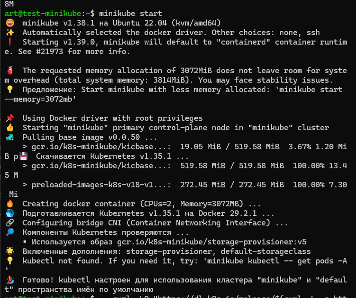
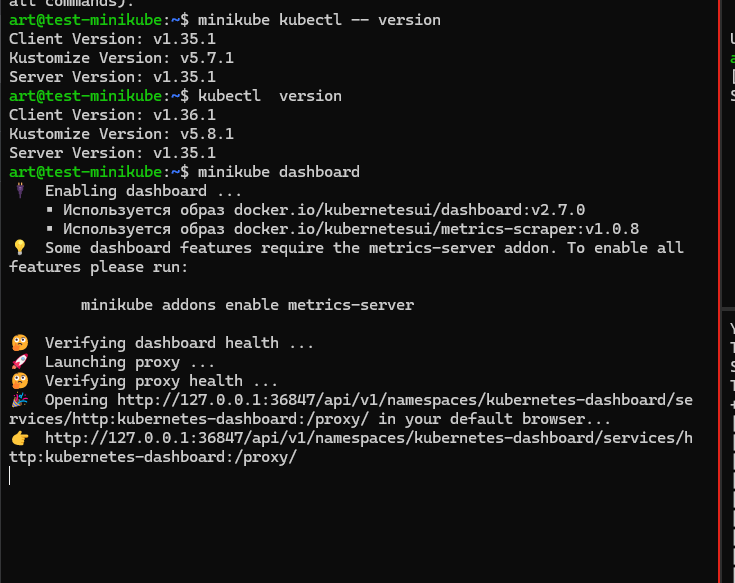
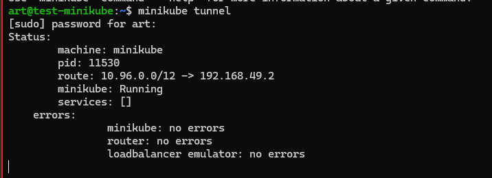
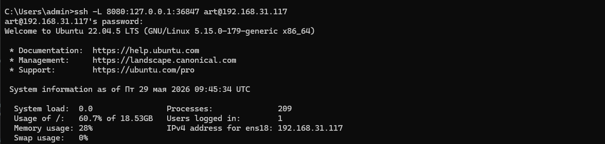
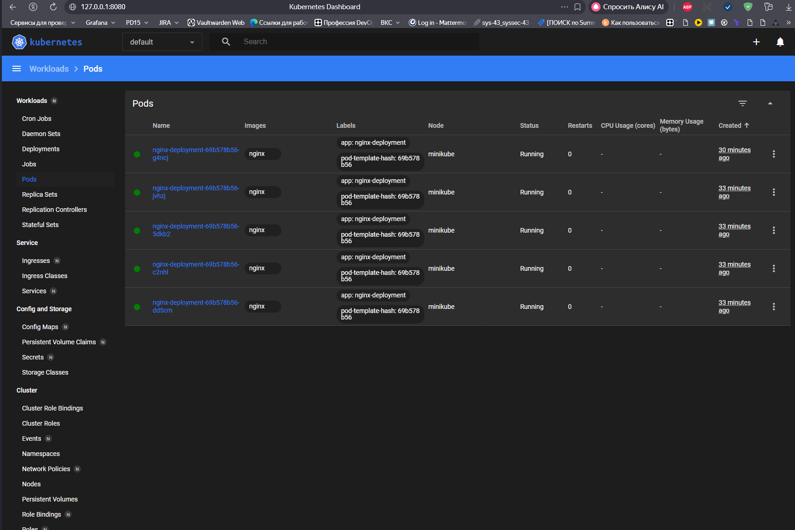

# DevOps_Netology_Homework_11-kuber-1

# Задание 1. Установка MicroK8S
- Установить MicroK8S на локальную машину или на удалённую виртуальную машину.
- Установить dashboard.
- Сгенерировать сертификат для подключения к внешнему ip-адресу.
# Задание 2. Установка и настройка локального kubectl
- Установить на локальную машину kubectl.
- Настроить локально подключение к кластеру.
- Подключиться к дашборду с помощью port-forward.
- Правила приёма работы
Домашняя работа оформляется в своём Git-репозитории в файле README.md. Выполненное домашнее задание пришлите ссылкой на .md-файл в вашем репозитории.
Файл README.md должен содержать скриншоты вывода команд kubectl get nodes и скриншот дашборда.


# Поставим minikube
```
curl -LO https://github.com/kubernetes/minikube/releases/latest/download/minikube-linux-amd64
sudo install minikube-linux-amd64 /usr/local/bin/minikube && rm minikube-linux-amd64
minikube start
```


#Установим  дашборд


# сделаем туннель
``` 
 minikube tunnel
```


# пробросим порт с локальной машины
```
ssh -L 8080:127.0.0.1:36847 art@192.168.31.117
```


# открываем страницу

http://127.0.0.1:8080/api/v1/namespaces/kubernetes-dashboard/services/http:kubernetes-dashboard:/proxy/#/pod?namespace=default


